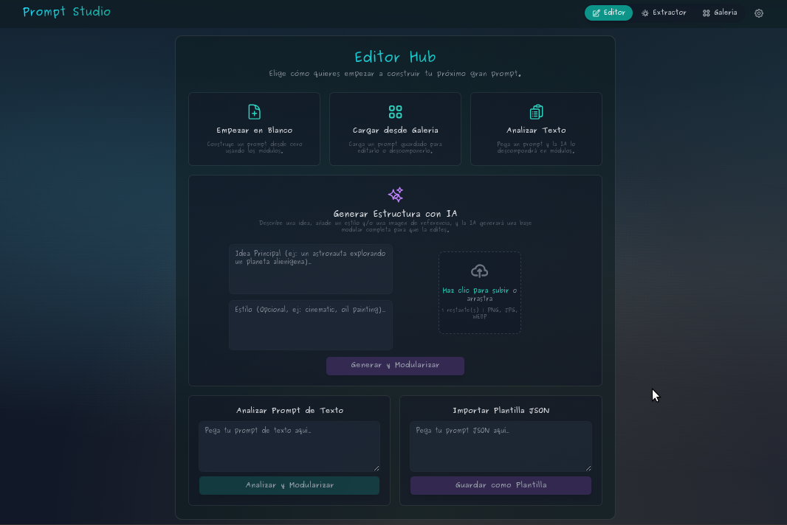

# Prompt Studio 🎨: Ingeniería de Prompts Modular e Inteligente

Prompt Studio es la aplicación líder en **Ingeniería Inversa de Prompts** para la generación de imágenes con IA. Utiliza modelos avanzados de Gemini para **descomponer imágenes o texto en 9 fragmentos editables**, permitiéndote crear, mezclar y optimizar *prompts* con precisión quirúrgica.

Esta aplicación web fue programada usando **Vibe Coding** asistido por **Google AI Studio**.

---

## 🚀 El Editor: Tu Entorno de Trabajo Modular

Hemos consolidado el flujo de trabajo en torno al **Editor Modular**, el corazón de la aplicación, ahora enriquecido con las funciones del **Ensamblador** y **Estructurador**.

### ✨ Características Clave y Flujos de Entrada

* **Análisis Inverso y Modularización (9 Fragmentos):** Descompón cualquier *prompt* de texto o JSON en **9 módulos editables** (Sujeto, Pose, Estilo, Composición, etc.) listos para ser modificados.
* **Ensamblador Transparente:** La herramienta para trabajar con **múltiples imágenes**. Sube imágenes directamente a cada módulo (Pose, Outfit, etc.). El sistema analiza y rellena el fragmento de texto correspondiente para que lo edites antes del ensamblaje.
* **Estructurador (Generación de JSON):** Usa una idea simple o una imagen de referencia para que la IA **genere una estructura JSON completa** que automáticamente llena los 9 módulos.

### 🧠 Lógica Maestra de Consistencia

El sistema aplica **Lógica de Prioridad y Filtrado** (Reglas Maestras) para eliminar redundancias y conflictos entre los fragmentos (ej., el color del Outfit vs. la Paleta de Colores) justo antes de generar el *prompt* final.

---

### 🖼️ Edición Granular y Optimización

Cada uno de los 9 fragmentos tiene su propia herramienta de refinamiento.

* **Optimización Contextual:** Recibe **sugerencias inteligentes** en tiempo real para cada módulo, basadas en el contexto del *prompt* completo que estás construyendo.

---

### 🛡️ Seguridad y Tecnología Flexible

La aplicación está construida sobre una arquitectura que respeta la seguridad de tu clave API y te da control total sobre tu consumo.

* **Seguridad por Defecto:** La aplicación utiliza una clave API segura, inyectada vía **variables de entorno**, por lo que **tu clave privada nunca se expone** en el código del lado del cliente.
* **Opción de Clave Propia:** Para uso intensivo o ilimitado, puedes ingresar tu propia clave API de Google en la sección de Configuración. Esta clave se almacena de forma segura en el **`localStorage`** de tu navegador, delegando el consumo de la API a tu propia cuota.

---

### 🛠️ Cómo Empezar

Para aprovechar las funciones de análisis y generación de *prompts*, solo necesitas una clave de API de Gemini.

1.  **Obtén tu API Key:** Ve a [Google AI Studio](https://ai.google.dev/gemini-api/docs/api-key) y haz clic en "Get API key".
2.  **Configura tu Clave en Prompt Studio (Opcional):** Abre la aplicación, busca el ícono de configuración (⚙️) e ingresa tu clave para uso personal.
3.  **¡Empieza a Crear Arte!** Usa el **Editor** para empezar, o el **Extractor** para analizar una imagen de forma aislada.

---

### 🤝 ¿Quieres Contribuir?

Si eres un apasionado del arte con IA y quieres mejorar Prompt Studio, ¡tu ayuda es bienvenida!

* Haz un Fork del repositorio.
* Crea una nueva Rama para tu mejora (`git checkout -b feature/AmazingArtFeature`).
* Haz tus Cambios y haz commit (`git commit -m 'Add some AmazingArtFeature'`).
* Haz Push a tu rama (`git push origin feature/AmazingArtFeature`).
* Abre un Pull Request.
